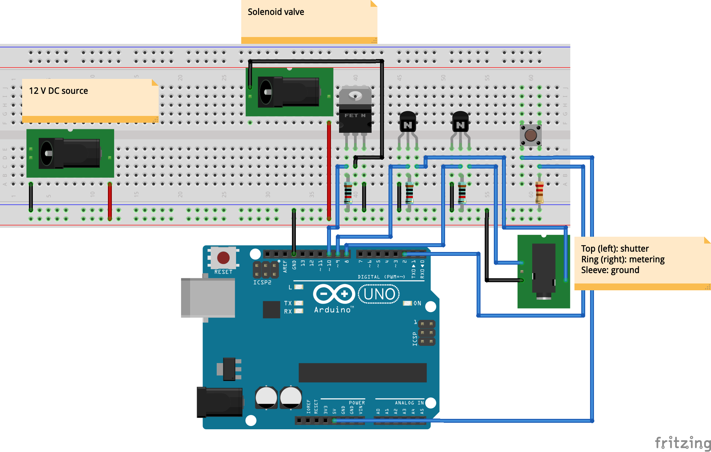

# WaterDropper
Arduino controlled solenoid valve for creative water photography.

## Circuit

## Sample Photos

[Sample Photo 1](https://www.flickr.com/photos/155165802@N05/27736965847/)

[Sample Photo 2](https://www.flickr.com/photos/155165802@N05/41704555945/)
